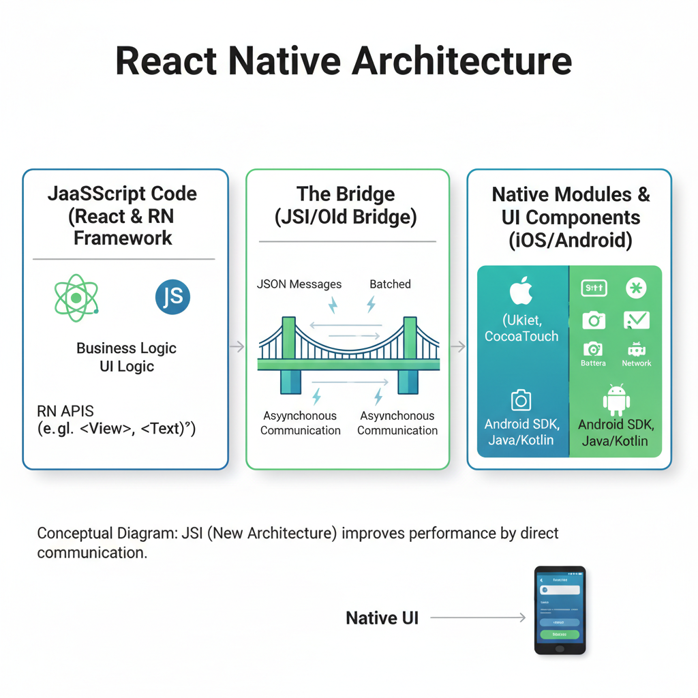
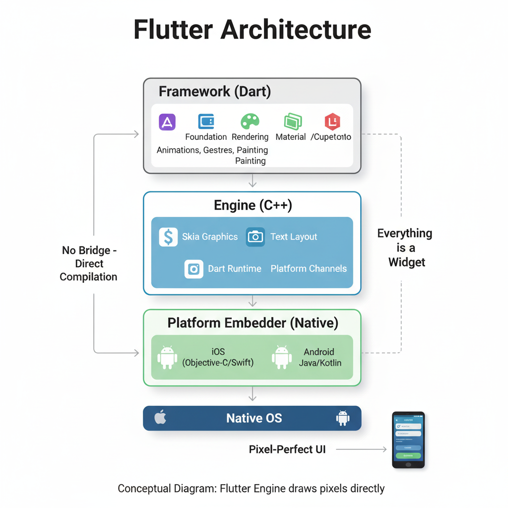

So, you're embarking on a new mobile app project, or perhaps you're looking to re-platform an existing one. And like many developers and businesses today, you're probably facing that age-old dilemma: React Native or Flutter? In the fast-evolving world of cross-platform development, this isn't just a technical choice; it's a strategic one that can impact your budget, timeline, and even your team's sanity!

As an experienced developer who's been in the trenches with both, I've seen these frameworks mature, evolve, and sometimes, even stumble. The landscape in 2025 is quite different from what it was just a few years ago. Let's dive deep and untangle this knot, shall we?

#### The Cross-Platform Promise: Why Even Bother?
Before we pit these giants against each other, let's briefly touch upon why cross-platform development has become so dominant. Native development, while offering peak performance and platform-specific features, often means building and maintaining two separate codebases (iOS and Android). This translates to:

- Higher Costs: Double the development effort, double the testing, double the maintenance.
- Longer Timelines: Releasing simultaneously on both platforms becomes a logistical puzzle.
- Resource Drain: You need separate teams or developers skilled in Swift/Kotlin/Java and Objective-C.

Cross-platform frameworks aim to solve these problems by allowing you to write most, if not all, of your codebase once and deploy it across both iOS and Android. Sounds like a dream, right? Well, it mostly is, but with nuanced trade-offs we'll explore.

#### Meet the Contenders: A Quick Introduction

##### React Native: The JavaScript Kingpin's Mobile Offspring

Born out of Facebook (now Meta) in 2015, React Native brought the declarative UI paradigm of React.js to mobile development. If you're a web developer familiar with React, the learning curve here is more of a gentle slope than a steep climb. It compiles to native UI components, giving your app a truly native look and feel.

##### Flutter: Google's UI Toolkit Maverick

Launched by Google in 2017, Flutter is a relatively newer entrant but has rapidly gained traction. It uses Dart as its programming language and offers a completely different approach: it draws its UI directly onto the screen using its own rendering engine (Skia). This "widget-everything" philosophy means incredible control over your UI.

#### Architectural Deep Dive: How They Work

Understanding their underlying architecture is crucial to appreciating their strengths and weaknesses.

##### React Native's Bridge to Native

React Native essentially uses a "bridge" to communicate between the JavaScript code and the native UI components. Your JavaScript code runs in a separate thread, and when it needs to interact with the UI or access native modules (like the camera or GPS), it sends messages across this bridge.

##### The Latest in 2025: Fabric & JSI (JavaScript Interface)

This is where React Native has seen significant evolution. The old bridge could sometimes be a bottleneck, leading to performance issues, especially with complex animations. Fabric, React Native's re-architecture of the rendering system, along with JSI, aims to eliminate these bottlenecks by allowing direct communication between JavaScript and native code, bypassing the asynchronous bridge. This is a game-changer, bringing React Native's performance much closer to native.

##### Flutter's Widget Wonderland

Flutter is fundamentally different. It compiles your Dart code to native ARM code, and crucially, it bypasses the OEM widgets entirely. Instead, it uses its own high-performance rendering engine, Skia (the same engine used in Chrome and Android), to draw every pixel on the screen. This means complete control over the UI, pixel by pixel, leading to incredibly consistent and smooth animations.

**No Bridge, Pure Performance:** This "no bridge" approach is Flutter's secret sauce for its often-touted performance benefits. It eliminates the communication overhead, making animations and UI transitions buttery smooth right out of the box.

##### Feature-by-Feature Showdown: The Tables Turn

Let's get down to the nitty-gritty with some comparison tables to help you visualize the differences.

##### 1. Performance & UI Rendering

| **Feature**        | **React Native (with Fabric/JSI)**                                                     | **Flutter**                                                      |
|--------------------|----------------------------------------------------------------------------------------|------------------------------------------------------------------|
| **Rendering**      | Renders to native UI components.                                                       | Renders directly using Skia engine (pixel-perfect).              |
| **Performance**    | Close to native, especially with Fabric. Bridge overhead reduced.                      | Near-native performance, consistently smooth animations.         |
| **UI Consistency** | Relies on native components; can vary slightly between platforms.                      | Pixel-perfect consistency across all platforms.                  |
| **Animations**     | Good, but complex animations can sometimes challenge the bridge (less so with Fabric). | Excellent, naturally smooth due to direct rendering.             |
| **Custom UI**      | Achievable, but may involve writing native modules.                                    | Highly flexible and customizable with its widget-based approach. |

##### 2. Development Experience & Ecosystem

| **Feature**        | **React Native**                                             | **Flutter**                                                    |
|--------------------|--------------------------------------------------------------|----------------------------------------------------------------|
| **Language**       | JavaScript/TypeScript                                        | Dart                                                           |
| **Learning Curve** | Easier for web developers (React.js background).             | Steeper for those new to Dart/declarative UI.                  |
| **Hot Reload**     | Yes, very good (saves immense development time).             | Yes, excellent (one of Flutter's standout features).           |
| **Tooling**        | Mature, extensive tools (ESLint, Prettier, VS Code plugins). | Comprehensive (Dart DevTools, VS Code/Android Studio plugins). |
| **IDE Support**    | Excellent across various editors.                            | Excellent with Android Studio/IntelliJ, VS Code.               |
| **Ecosystem**      | Vast NPM package ecosystem, often requires native linking.   | Pub.dev for Dart packages, usually "just works."               |
| **Community**      | Large, mature, diverse.                                      | Rapidly growing, vibrant, and very active.                     |

##### 3. Job Market & Future Trends

| **Feature**       | **React Native**                                              | **Flutter**                                                         |
|-------------------|---------------------------------------------------------------|---------------------------------------------------------------------|
| **Job Market**    | Strong and established, especially for web-focused companies. | Rapidly expanding, high demand for skilled Flutter developers.      |
| **Maturity**      | More mature, longer history.                                  | Younger but growing at an exponential rate.                         |
| **Latest Trends** | Fabric/JSI for performance, Web/Desktop expansion.            | Web &amp; Desktop (macOS, Windows, Linux) stable, Embedded devices. |
| **Market Share**  | Still holds a significant share.                              | Gaining market share rapidly year-over-year.                        |

##### Real-World Applications: Who's Using What?

Seeing these frameworks in action often provides the best validation.

**Apps Built with React Native:**

**Facebook**: Yes, the creator uses it for parts of its own app!

**Instagram**: A heavily used social media app leveraging React Native.

**Discord**: Popular communication platform.

**Shopify**: E-commerce giant using it for their merchant apps.

**Microsoft Office**: Believe it or not, some parts use React Native!

**Apps Built with Flutter:**

**Google Pay**: Google's own payment app (makes sense!).

**BMW**: The automotive giant uses Flutter for some of its in-car experiences.

**Alibaba**: E-commerce behemoth using it for some of its apps.

**Tencent**: Chinese tech giant has several apps built with Flutter.

**New York Times**: Experimenting with Flutter for various projects.

##### Pros and Cons: A Balanced Perspective

**React Native**

**Pros:**

- Familiarity for Web Devs: If your team is already strong in React.js, the ramp-up time is significantly shorter.

- Mature Ecosystem: A vast array of libraries, tools, and third-party packages.

- "Native Look and Feel": By rendering to native UI components, apps often seamlessly blend into the OS.

- Large Community: A huge and active community means more resources, tutorials, and quicker bug fixes.

- Hot Reloading: Speeds up development cycles dramatically.

**Cons:**

- Potential Performance Bottlenecks: While Fabric greatly mitigates this, the bridge can still be a factor in highly complex, animation-heavy apps (though this is increasingly rare).

- Dependency on Native Modules: For certain features, you might still need to write native code, requiring Swift/Kotlin knowledge.

- Fragmentation of Packages: Quality and maintenance of third-party packages can vary.

- Debugging Can Be Tricky: Interacting with the native layer can sometimes complicate debugging.

**Flutter**

**Pros:**

- Exceptional Performance: Near-native performance, especially for UI and animations, thanks to its direct rendering approach.

- Pixel-Perfect UI: Complete control over every pixel, ensuring consistent UI across all devices and OS versions.

- Rapid Development: Hot Reload, expressive UI, and rich widget catalog accelerate the development process.

- Growing Ecosystem: While younger, the pub.dev package repository is thriving, and new packages are constantly emerging.

- Single Codebase for Multiple Platforms: Beyond mobile, Flutter truly shines with stable support for web, desktop (Windows, macOS, Linux), and even embedded devices.

- Dart is a Delight: Many developers find Dart a pleasant language to work with, combining aspects of object-oriented and functional programming.

**Cons:**

- Steeper Learning Curve (for some): Developers new to Dart or the "widget-everything" philosophy might take longer to get comfortable.

- Larger App Size: Flutter apps tend to have a slightly larger binary size due to shipping the Skia engine and Dart runtime.

- Smaller Community (but rapidly growing): While incredibly vibrant, it's still smaller than React Native's established community.

- Fewer Third-Party Integrations (historically): While improving rapidly, some very niche native SDKs might not have a direct Flutter plugin.

- Not Truly "Native Looking": While you can mimic native aesthetics (Material Design for Android, Cupertino for iOS), it's still drawing its own widgets, not using the OS's native ones.

##### Use Cases: When to Choose Which

The "best" framework really boils down to your specific project needs. There's no one-size-fits-all answer.

**Choose React Native if:**

- You have an existing web team proficient in React.js. The synergy and code reuse are undeniable.

- Your app relies heavily on native UI components and you want that authentic platform feel without extensive custom design.

- You need quick iterations and a faster time-to-market for an MVP, leveraging a vast component library.

- Your app doesn't require extremely complex animations or heavy graphical processing. (Though Fabric significantly closes this gap).

- You prioritize a large, established community and a wealth of existing resources.

**Choose Flutter if:**

- You need a highly custom, branded UI that looks identical across all platforms, regardless of OS updates.

- Performance and smooth animations are critical to your app's user experience (e.g., gaming, highly interactive apps).

- You're targeting multiple platforms beyond mobile (web, desktop, embedded) from a single codebase. This is a massive advantage.

- You're building a new app from scratch and are open to learning Dart.

- Your team enjoys a highly opinionated framework that provides most of what you need out-of-the-box.

- You're a startup looking for efficiency and a modern tech stack.

##### Conclusion: Your Project, Your Choice

In 2025, both **React Native** and **Flutter** are mature, powerful, and excellent choices for cross-platform mobile development.

React Native, with its mature ecosystem, vast community, and the significant performance enhancements from Fabric and JSI, continues to be a powerhouse, especially for teams rooted in JavaScript/React. It offers a bridge to native that feels increasingly seamless.

Flutter, on the other hand, with its unparalleled UI control, consistent performance, and ambitious expansion into web, desktop, and embedded, is an incredibly compelling option, particularly for visually rich applications and those aiming for true multi-platform deployment from a single codebase.

**My advice?**

- Evaluate your team's existing skill set. This is often the most practical starting point.

- Define your app's core requirements. Is it UI-heavy? Performance-critical? Does it need extensive native feature integration?

- Consider your long-term roadmap. Are you planning to expand to web or desktop? Flutter has a distinct advantage here.

- Try them out! Build a small proof-of-concept with both. Nothing beats hands-on experience to understand the developer experience.

Ultimately, both frameworks are here to stay, constantly innovating and pushing the boundaries of what's possible in cross-platform development. The "winner" isn't a fixed title; it's the one that best aligns with your project's unique DNA.

**Happy coding!**