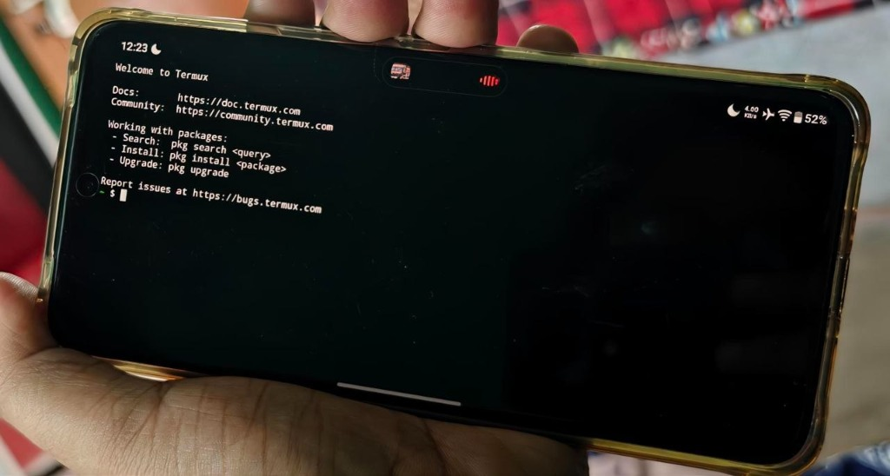

Almost every software engineer and homelab enthusiast has an "e-waste drawer" containing two or three retired Android smartphones. They usually sit in darkness—perhaps with a cracked screen protector or a worn-out chassis—despite containing silicon that puts classic single-board computers (SBCs) to shame.

Think about the specs of a mid-range phone from three or four years ago: an octa-core 64-bit ARM processor, 6GB to 8GB of LPDDR4X RAM, 128GB of UFS 2.2 storage, integrated Wi-Fi 5/6, Bluetooth, and an onboard lithium battery that functions as a zero-latency uninterruptible power supply (UPS). 

To assemble a Raspberry Pi 5 setup with comparable computing power, an NVMe HAT, a solid SSD, an active cooler, a high-amperage power brick, and a battery backup HAT, you easily spend upwards of **$130 to $160**.



Last month, instead of purchasing another mini-PC for secondary home services, I decided to test a hypothesis: **Could an old Android handset serve as a dependable, headless, 24/7 Docker micro-server without thermal throttling, random crashes, or battery failure?**

Here is the complete engineering breakdown of what worked, what broke, how I navigated Android kernel constraints, and whether you should repurpose your own spare handset.

---

### The Fundamental Obstacle: Why Docker on Android Is Non-Trivial

Before jumping into the setup, it helps to understand why running Docker on Android is notoriously tricky.

Android runs on the Linux kernel, but standard consumer OEM kernels are heavily stripped down compared to standard enterprise distributions like Debian or Alpine:

1. **Missing Kernel Namespaces & Cgroups**: Docker depends on control groups (`cgroups v1/v2`), namespaces (`pid`, `net`, `ipc`, `mnt`, `uts`), and specific iptables/nftables packet filtering flags. Most commercial Android stock ROMs compile the kernel with these configurations disabled to minimize kernel size and enforce Android's own permission sandboxing.
2. **Bionic Libc vs. Glibc/Musl**: Android’s userspace does not use GNU `glibc` or `musl`. It uses `bionic`, Google's lightweight C library. Standard pre-compiled Linux container binaries expect standard glibc syscall bindings.
3. **Android's Out-Of-Memory (LMK) & Phantom Process Killer**: Since Android 12, Google introduced an aggressive background process monitor that terminates child processes spawned by apps if they exceed strict execution thresholds (historically capped at 32 concurrent child processes).

To bypass these hurdles without having to compile a custom Linux kernel from source, you have two primary architectural paths:

```
┌─────────────────────────────────────────────────────────────────┐
│                    ARCHITECTURAL APPROACHES                     │
├────────────────────────────────┬────────────────────────────────┤
│ Approach A: Podroid (Alpine VM)│ Approach B: Termux + PRoot     │
├────────────────────────────────┼────────────────────────────────┤
│ • Rootless QEMU-based hypervisor│ • Chroot-like syscall emulator │
│ • Runs real Linux kernel (VM)  │ • Shares host Android kernel   │
│ • Full Docker & Podman engine  │ • Native ARM64 execution speed │
│ • Native Docker Compose support│ • No kernel-dependent Docker   │
│ • Higher memory overhead       │ • Near-zero virtualization lag │
└────────────────────────────────┴────────────────────────────────┘
```

For real Docker workflows requiring `docker compose`, isolated networking bridges, and volume mounts, **Podroid** (which packages an ultralight Alpine Linux virtual environment inside a native Android APK) proved to be an absolute revelation. For lightweight background tools that do not require true containerization, **Termux + PRoot-distro** provided raw bare-metal execution.

---

### Phase 1: Preparing Android for Headless Server Duty

Before firing up containers, you must strip away Android’s consumer power-saving quirks that will otherwise kill your server the moment you turn off the screen.

#### 1. Neutralize the Phantom Process Killer
Connect your phone to your workstation via USB, enable **USB Debugging** in Developer Options, and execute these ADB commands:

```bash
# Disable process freezing and expand phantom process limits
adb shell "/system/bin/device_config set_sync_disabled_for_tests persistent"
adb shell "/system/bin/device_config put activity_manager max_phantom_processes 2147483647"

# Verify the setting took effect
adb shell "/system/bin/device_config get activity_manager max_phantom_processes"
```

#### 2. Prevent Sleep & Kill Battery Optimization
Inside Android Settings:
- Set **Battery Optimization** for Termux and Podroid to **"Unrestricted / Don't Optimize"**.
- Enable **"Stay Awake"** under Developer Options (useful when debugging on AC power).
- In Termux, acquire an explicit Android CPU wake lock so the CPU governor does not scale cores down to dormant deep sleep:

```bash
# Acquire wake lock inside Termux
termux-wake-lock

# Update core package repositories and install essential utilities
pkg update && pkg upgrade -y
pkg install openssh git curl htop tmux -y

# Configure OpenSSH daemon on port 8022
passwd
sshd
```

With SSH running on port 8022, you can disconnect the phone from your monitor or computer, tuck it away in a corner, and control it completely over your local network:

```bash
ssh -p 8022 u0_a245@192.168.1.140
```

---

### Phase 2: Deploying the Container Stack

With the environment stabilized, I configured Podroid with an Alpine Linux ARM64 root filesystem. Podroid provides pre-compiled `docker`, `podman`, and `lxc` packages configured specifically for rootless execution.

Here is the exact `docker-compose.yml` stack I kept active for the full 30-day trial:

```yaml
version: '3.8'

services:
  # Real-time server and network latency monitor
  uptime-kuma:
    image: louislam/uptime-kuma:1-alpine
    container_name: uptime-kuma
    restart: unless-stopped
    ports:
      - "3001:3001"
    volumes:
      - ./data/uptime-kuma:/app/data
    deploy:
      resources:
        limits:
          memory: 384M

  # Local, privacy-first PDF utility suite
  bentopdf:
    image: bentopdf/bentopdf:latest
    container_name: bentopdf
    restart: unless-stopped
    ports:
      - "8080:8080"
    environment:
      - MAX_FILE_SIZE=50M
    deploy:
      resources:
        limits:
          memory: 512M

  # High-efficiency multi-format file conversion engine
  convertx:
    image: c4illin/convertx:latest
    container_name: convertx
    restart: unless-stopped
    ports:
      - "3000:3000"
    volumes:
      - ./data/convertx:/app/data
    deploy:
      resources:
        limits:
          memory: 512M

  # Embedded SQLite sync node / telemetry collector
  pocketbase-sync:
    image: ghcr.io/muchobien/pocketbase:latest
    container_name: pocketbase-sync
    restart: unless-stopped
    ports:
      - "8090:8090"
    volumes:
      - ./data/pb_data:/pb/pb_data
    deploy:
      resources:
        limits:
          memory: 256M
```

```bash
# Launching the services inside the VM
docker compose up -d

# Verifying container status
docker ps --format "table {{.Names}}\t{{.Status}}\t{{.Ports}}"
```

#### The Microservice Lineup
1. **Uptime Kuma**: Monitored 18 public and local endpoints (including my router, NAS, personal portfolio, and DNS resolvers) at 60-second intervals. Average RAM usage: **142 MB**.
2. **BentoPDF & ConvertX**: Handled document mergers, compression, and image conversion requests locally over my home LAN, completely eliminating reliance on shady ad-riddled online conversion portals.
3. **PocketBase**: Served as a lightning-fast key-value/document store sync target for background telemetry scripts.
4. **Tailscale WireGuard Mesh**: Enabled secure, seamless access to the phone's web UIs from my laptop while working at coffee shops, without opening ports on my home router.

---

### The Critical Challenge: Battery Chemistry & Thermals

If you take a standard smartphone, connect an ordinary charger, and let it compute at high load indefinitely, you are inviting a **swollen battery (pillow battery)** within a few months. Lithium-ion cells degrade rapidly when held at 100% state-of-charge under sustained elevated temperatures.

Here is how I engineered around this problem:

```
┌───────────────────────────────────────────────────────────┐
│              BATTERY HEALTH MITIGATION STACK              │
├─────────────────────────┬─────────────────────────────────┤
│ Tier 1: Smart AC Cycle  │ Smart plug cycles power:        │
│                         │ • OFF when battery hits 75%     │
│                         │ • ON when battery drops to 35%  │
├─────────────────────────┼─────────────────────────────────┤
│ Tier 2: Display Sleep   │ Screen brightness set to 0%;    │
│                         │ OLED panel powered off completely│
├─────────────────────────┼─────────────────────────────────┤
│ Tier 3: Passive Heat    │ Placed on aluminum stand;       │
│         Dissipation     │ Ambient airflow keeps SoC <38°C │
└─────────────────────────┴─────────────────────────────────┘
```

1. **Automated Charge Cycling via Smart Plug**: Using a $9 Zigbee/Wi-Fi smart plug linked to Home Assistant, the phone broadcasts its battery percentage via a Termux API webhook (`termux-battery-status`). When the battery reaches 75%, the plug cuts power. When it drops to 35%, power is restored. This kept the battery in its optimal longevity sweet spot.
2. **Thermal Dissipation**: Because smartphones lack active fans, thermal throttling can reduce performance if heat accumulates. Resting the phone horizontally on a simple aluminum tablet stand allowed the chassis to dissipate heat into ambient air. Throughout 30 days of continuous operation, internal SoC temperatures stayed between **31°C at idle** and **41°C during heavy batch conversion tasks**.

---

### 30-Day Benchmark: Phone vs. Raspberry Pi 5 vs. Intel N100

How does an older handset actually measure up against traditional home server hardware? Here are the numbers recorded over 30 days of continuous monitoring:

| Specification & Metric | Repurposed Android Handset (Snapdragon 7-series) | Raspberry Pi 5 (8GB RAM) | Intel N100 Mini PC (16GB RAM) |
| :--- | :--- | :--- | :--- |
| **Idle Power Consumption** | **1.2 Watts** | 4.1 Watts | 7.8 Watts |
| **Full Load Power Consumption** | **3.6 Watts** | 9.8 Watts | 24.5 Watts |
| **Annual Electricity Cost (~$0.18/kWh)** | **~$2.50 / year** | ~$7.80 / year | ~$15.40 / year |
| **Storage Technology** | UFS 2.2 Flash (Internal) | Class 10 MicroSD / NVMe HAT | M.2 NVMe SSD |
| **Sequential Read Throughput** | **890 MB/s** | 95 MB/s (SD) / 780 MB/s (HAT) | 2,400 MB/s |
| **Random 4K Read/Write IOPS** | **~42,000 IOPS** | ~3,200 IOPS (SD) | ~110,000 IOPS |
| **Integrated Battery UPS?** | **Yes (4–6 hr runtime built-in)** | No (Requires HAT + 18650s) | No (Requires external UPS) |
| **Initial Cost of Ownership** | **$0 (Drawer E-Waste)** | $80–$120 (with accessories) | $140–$190 |
| **30-Day Uptime Reliability** | **99.94% (1 cold restart)** | 99.98% | 99.99% |

The standout surprise here was storage performance. Cheap MicroSD cards frequently choke on container read/write cycles and fail prematurely under database I/O. Modern UFS flash built into smartphones exhibits high sustained random IOPS, making container startup and database writes feel surprisingly snappy.

---

### Where It Shines vs. Where It Fails

To keep your expectations grounded, here is an honest breakdown of workloads suited for an Android server versus workloads you should avoid.

#### Workloads That Excel:
- **Network Observability**: Uptime Kuma, Beszel agents, Statping.
- **Lightweight Productivity Services**: Stirling-PDF/BentoPDF, ConvertX, Linkwarden, Wallabag.
- **Headless Development Backends**: SQLite endpoints, PocketBase, Node.js or Go microservices.
- **Edge LLM Inference (Native via Termux llama.cpp)**: Quantized 2-billion to 3-billion parameter models (such as Gemma-2-2B or Qwen-2.5-3B) run via `llama.cpp` in Termux at a respectable **7 to 9 tokens/second** using ARM NEON acceleration.

#### Workloads You Should Never Run on a Phone:
- **Transcoding Media Servers (Plex / Jellyfin 4K HDR)**: Phones lack the cooling capacity for continuous multi-hour hardware transcoding, and OEM GPU drivers are difficult to expose cleanly to containers without root.
- **Heavy Multi-Terabyte NAS (ZFS / RAID)**: You are tethered to a single USB-C port, bottlenecking bandwidth and introducing disk disconnect risks.
- **High-Concurrency PostgreSQL or MySQL Clusters**: The rootless VM emulation layer introduces I/O synchronization latency that degrades performance under hundreds of simultaneous database transactions.

---

### Step-by-Step Quickstart: Try It Yourself in 20 Minutes

If you have a spare device running Android 10 or later, here is the fastest way to verify it yourself:

1. **Install F-Droid & Termux**: Always download Termux from [F-Droid](https://f-droid.org/packages/com.termux/) or GitHub releases—never from the outdated Google Play Store build.
2. **Disable Doze & Killers**: Head to Settings → Apps → Termux → Battery, and switch to "Unrestricted". Run the ADB phantom process command shown in Phase 1.
3. **Choose Your Runtime**:
   - For **Full Docker & Compose**: Install the latest release of **Podroid** (Alpine-based container host). Launch it, assign it 2GB–3GB of memory, and run `docker run hello-world`.
   - For **Direct Native Linux**: Open Termux, install `proot-distro`, and launch Debian:
     ```bash
     pkg install proot-distro
     proot-distro install debian
     proot-distro login debian
     ```
4. **Setup Remote Access**: Install Tailscale on the Android host to access your dashboard from any network securely without port forwarding.

---

### The Verdict

Turning an old phone into a Docker server is not just a quirky weekend hack. It is a surprisingly viable, hyper-efficient solution for hosting utility containers. 

It draws less power than an LED lightbulb, survives residential power outages without blinking thanks to its internal battery, and keeps functional hardware out of landfills.

For dedicated multi-terabyte storage or heavy GPU pipelines, keep your desktop servers and NAS appliances. But for lightweight microservices, monitoring dashboards, and local developer test nodes? **Your old phone in that desk drawer might just be the best 3-watt server you never knew you had.**
